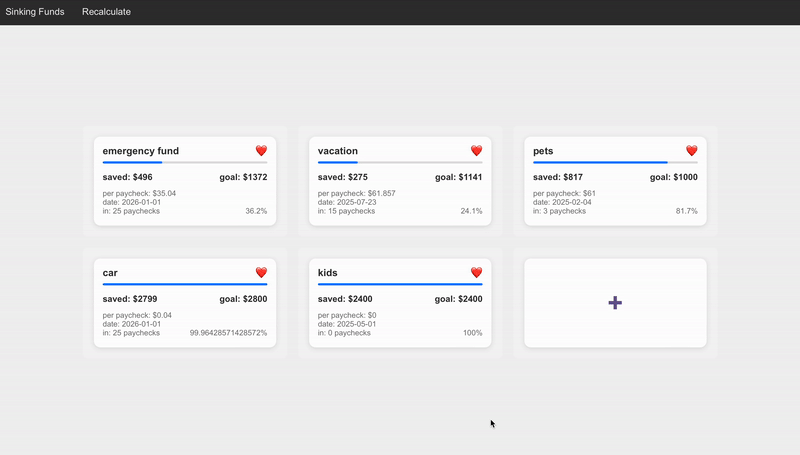

This application provides a straightforward way to manage your sinking funds. Inspired by Ally Bank's bucket system, it eliminates the hassle of maintaining separate notes to track contributions per paycheck. Built with React, this app offers an intuitive interface to replicate the bucket system, calculate how much to add, and monitor contributions based on your paycheck schedule.

**Extracted Functionality:**
1. **Sinking Fund Management**: Organize and track your sinking funds effectively.
2. **Bucket System Replication**: Mimics Ally Bank's bucket system for financial planning.
3. **Paycheck Contribution Calculation**: Automatically calculates how much to contribute per paycheck.
4. **Contribution Tracking**: Provides insights into total contributions over time.
5. **User-Friendly Interface**: Designed with an intuitive React-based interface for ease of use.

## **Instructions**

start flask server
1. `cd src`
2. `python flask-connector.py`
3. verify at http://127.0.0.1:5000/ ("hi!")
4. Set up database -- change DB name in `src/paycheck/utils/reference/database_constants.py`

`http://127.0.0.1:5000/delete_database`

`http://127.0.0.1:5000/setup_database`

`http://127.0.0.1:5000/add_mock_data`

start react app
1. `cd web-app`
2. `npm install`
3. `npm start`
4. verify at http://localhost:3000!

## **Demo**

</img>

## **Todo**
* Add other pay schedules
* Add ability to rearrange
* Make saving and changing values more intuitive
* Spruce up the UI
